# Savant

[Visit the Savant deployed page here!](http://savant-eb.herokuapp.com) (In-Depth Demo at the end of ReadMe)


Savant is a free, user-content driven portal for online tutorials and classes. Our motto is "Education through observation". 

Knowledge is something that should be shared and this platform enables instructors to broadcast their expertise with the world via YouTube livestream.

___


## Prerequisites 

Things you will need:

* Files in this repo (excluding git images)

* [NodeJS](https://nodejs.org/) on your local or remote machine.

* [NPM](https://www.npmjs.com/) packages to install dependencies (built into NodeJS)

* [MySQL](https://www.mysql.com/) to save data persistently.

  * If deploying to [Heroku](https://www.heroku.com/), install [JawsDB](https://elements.heroku.com/addons/jawsdb) as a resource and [CLI](https://devcenter.heroku.com/articles/creating-apps) to create an app

* [Firebase](https://console.firebase.google.com/) application, to connect to authentication servers for saving accounts.

* [AWS S3 Buckets](https://docs.aws.amazon.com/AmazonS3/latest/dev/UsingBucket.html) for saving and hosting user profile pictures.
___

### Keys

* After creating a firebase application, you will see three options: IOS, Android, Web. You will need to choose Web, fill out the form (without adding a host/domain). Then firebase will create a keyfile configuration for you. Copy this keyfile and the html cdns. 

* After creating an AWS S3 Bucket, you will need to [create secret access keys](https://supsystic.com/documentation/id-secret-access-key-amazon-s3/). Save these alongside firebase's key.


The keys generated from both apps, will be sent to a .env file. Here is the format:

```
firebase_apiKey="an-alphanumeric-key"
firebase_authDomain="name.firebaseapp.com"
firebase_databaseURL="https://name.firebaseio.com"
firebase_projectId="app-name"
firebase_storageBucket=""
firebase_messagingSenderId="number"
firebase_appId="alphanumeric"

S3_BUCKET_NAME="app-name"
AWS_ACCESS_KEY_ID="alphanumeric"
AWS_SECRET_ACCESS_KEY="alphanumeric"
```

Make sure to keep case-sensitivity accurate and all in quotes. The application will use these to authenticate with the respective servers. 

If you will be running this on Heroku, these keys will be put into the "vars config" section within the Settings of the app created- however make sure not to add quotes when inputting the values.

___

### Deployment

Once the .env file is created, or Heroku has all of the keys ready, you may install all important dependencies by executing: `npm install` in the terminal. The command reads the package.json and installs all of the modules necessary. If you are deploying to Heroku, they will install them for you and run the server.

To run the server on your local machine, you may run the server.js script with the command: `node server.js`. The express package will serve the application on a default port 3000 & can visit the app on localhost:3000; as for Heroku, you may visit the site provided to you.


___

## Design

* User account creation
  * Savant users may begin with creating a user profile by entering their username, email, password, any form of contact url, and an avatar .jpg image file. 

  * The profile image will be saved to the AWS S3 Bucket server. Once uploaded, the user may continue to fulfill the account creation.

* Class creation

  * After the account has been created, the Savant user can opt to teach a class by providing a class title. Once the title is given, the user must log into their google account to continue. This is so that the user is verified to be able to create Youtube livestreams. Once the instructor is logged in, the rest of the fields will be unlocked.

  * The user instructor then provides a class description, class description via drop-down menu, and schedules a date/time in Google Calendar. Upon sumbit, the YouTube API generates an embed with the livestream url. Then the user can accept the class submission to our site.

* Page Stylings

  * The UI for Savant makes extensive use of Twitter Bootstrap CDN, animate.css, Google Fonts, and Font Awesome to create an engaging UX. 
  
  * Registered classes are displayed within dynamically generated cards within a Bootstrap carousel. 
  
  * Embedded within each class card is YouTube livestream iframe and course information from the YouTube API. 
  
  * The motto tagline and "Teach a Class"/"Learn A Skill" buttons are animated via class names in animate.css for aesthetic effect. 
  
  * Bootstrap's forms and modals provide streamlined structure to collect data values in order to make API calls and populate our sequelize models.

___
## Code Snippets

* Google Calendar:

  * Load in the keys and scopes to connect to Google Calendar.
  
    * 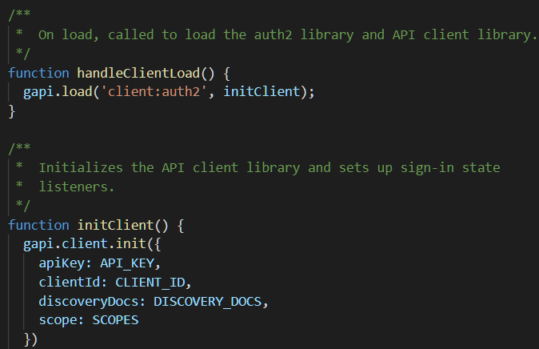

  * Create the event object based on the title, date, and description of the connected card.
  
    * 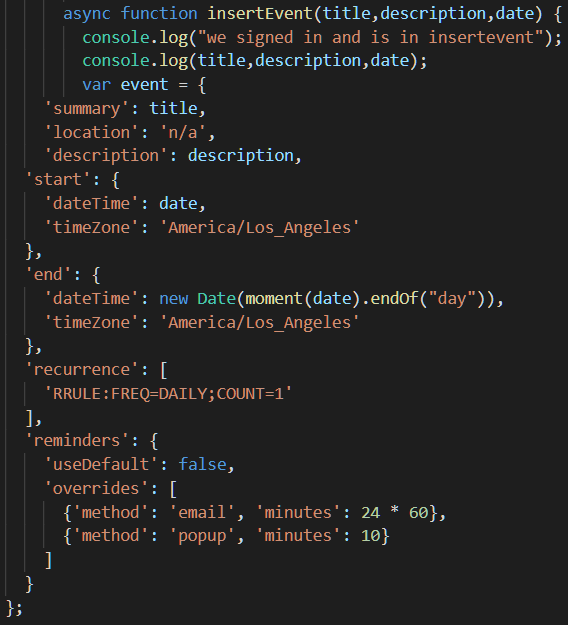

  * Let the user sign in, then insert event to their personal calendar.
  
    * 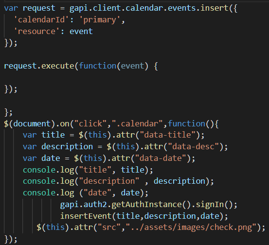

* Youtube API:


  * Initialize google with the youtube scope
  
    * 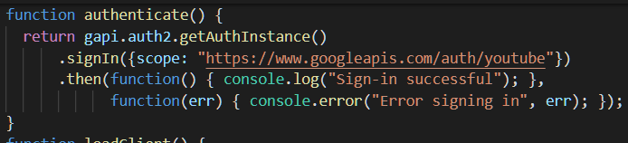

  * Load in YT client for auth with the key.
  
    * 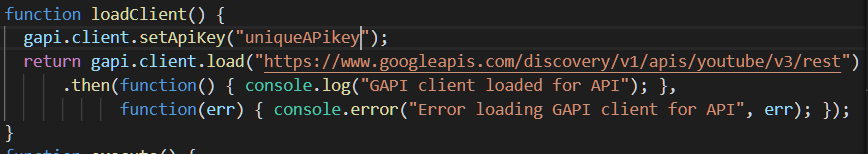

  * Create the youtube livestream content and return the live-embed
  
    * 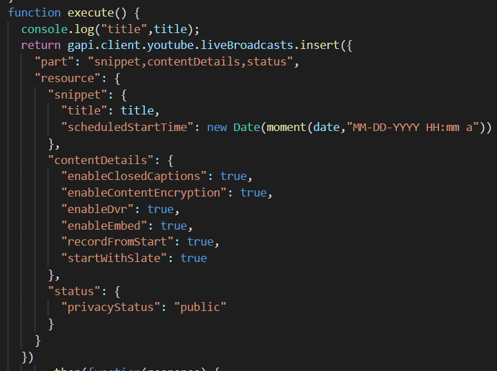


* AWS S3 Buckets:


  * Make a POST request with the file input and username. Once the image is uploaded, create an object of user data with the image url to send to the database.
  
    * 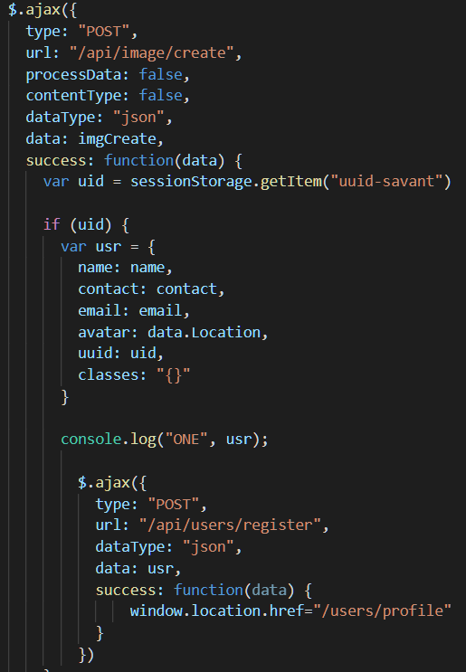

  * When the image is received, we get the data of the image and send it to s3 servers with a unique name. Once it is uploaded, return connecting data including the picture link.
  
    * 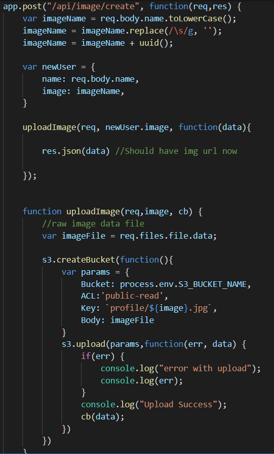


* Firebase Auth: 


  * Creating a connection to the auth servers with the given key.
  
    * 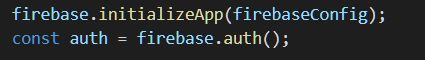

  * Using the provided email & pass, sign user into the site. Else, return an error. 
  
    * 
  
  * If the account does not exist, user may run a createUserWithEmailAndPassword function.

    * 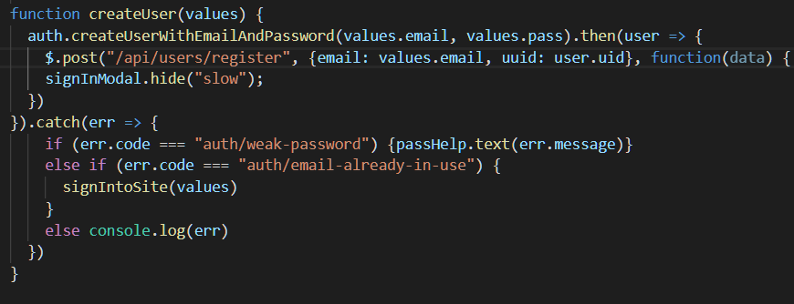
  
  * When the user logs in, retrieve the uuid to send to the server whenever data is needed. Else remove the uuid upon log out.
  
    * 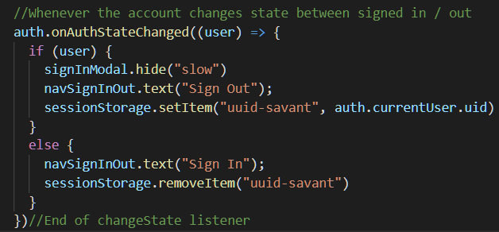

___

## Technologies Used
___

* [HTML](https://developer.mozilla.org/en-US/docs/Web/Guide/HTML/HTML5): Foundational structure of page elements.
* [CSS](https://developer.mozilla.org/en-US/docs/Web/CSS): Styling of elements on the html page.
* [JavaScript](https://developer.mozilla.org/en-US/docs/Web/JavaScript/Reference): Main language used to run the application.
* [Node.js](https://nodejs.org/en/docs/): Run-time environment that executes JavaScript code.
* [Express](https://www.npmjs.com/package/express): Web App framework to serve webpages.
* [Bootstrap](https://getbootstrap.com/docs/4.3/getting-started/introduction/): Library to add styling alongside content.
* [Google Fonts](https://developers.google.com/fonts/): Unique font types for webpage text.
* [Animate.css](https://github.com/daneden/animate.css): Custom animations on elements.
* [JQuery](https://api.jquery.com/): Dynamically changing content and adding functionality to elements.
* [MySQL](https://dev.mysql.com/doc/): Database used to store persistent data.
* [Sequelize](http://docs.sequelizejs.com/manual/getting-started.html): Easy and versatile ORM to communicate with MySQL.
* [AJAX](https://api.jquery.com/category/ajax/): Calls between server and client to serve and retrieve data.
* [Firebase](https://firebase.google.com/docs): Client side authentication stored in Google's Firebase auth/db servers.
* [Moment.JS](https://momentjs.com/docs/): Custom time formats displayed to the client and date manipulation.
* [YouTube API](https://developers.google.com/youtube/v3/): Livestreaming api functionality authenticated by google account.
* [Google Calendar API](https://developers.google.com/calendar/): Calendar api functionality authenticated by google account.
* [AWS S3 Buckets](https://aws.amazon.com/s3/): Storing files in specific bucket/section on Amazon Web Services.
* [Font Awesome](https://fontawesome.com/): Custom unique fonts for webpage text.
* [Tempus Dominus DatePicker](https://tempusdominus.github.io/bootstrap-4/): Client-Side Date and time creator & manipulation.

___

Commit History:
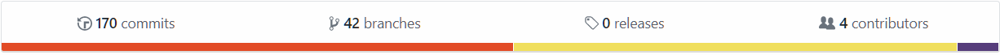

Commit Charts:
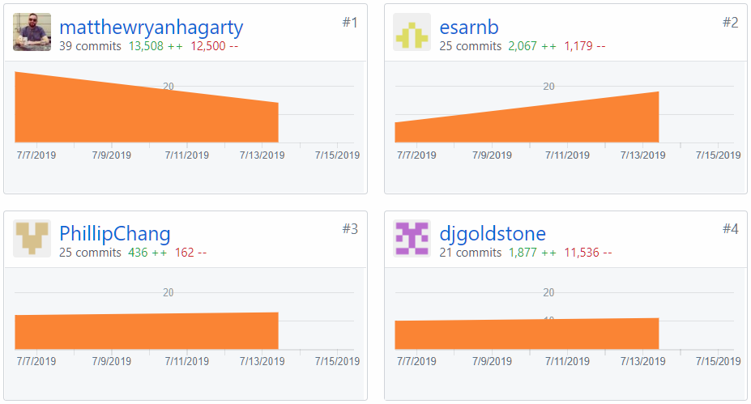
___
Landing Page:


Sign Up Page:
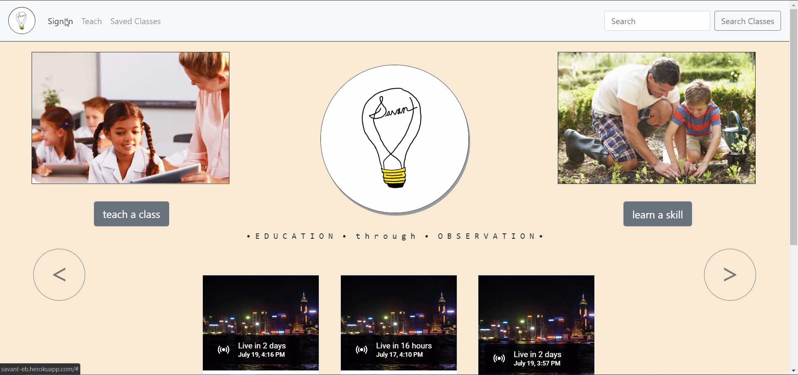

Sign In Modal:
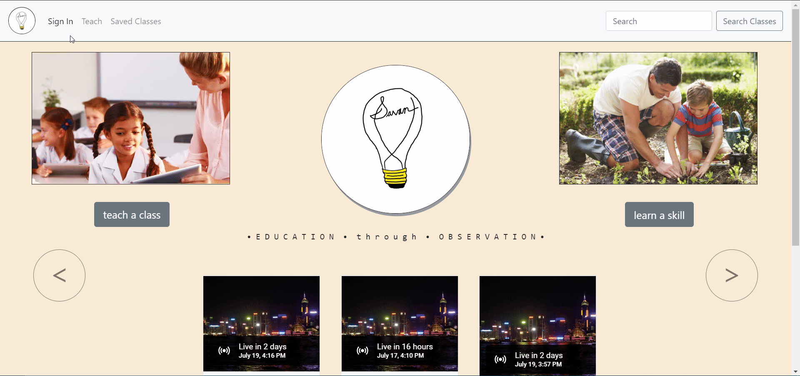

Profile Page:
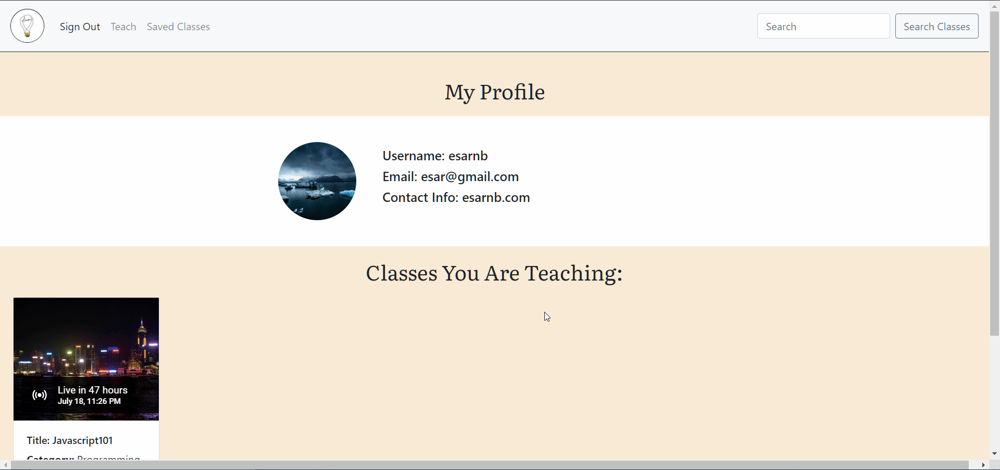

___

## Authors

* Esar Behlum - [Github Link](https://github.com/esarnb) & [LinkedIn Link](https://www.linkedin.com/in/esarnb/)

* Phillip Chang - [Github Link](https://github.com/PhillipChang) & [LinkedIn Link](https://www.linkedin.com/in/phillipchang1/)

* Derek Goldstone - [Github Link](https://github.com/djgoldstone/) & [LinkedIn Link](https://www.linkedin.com/in/derek-goldstone-482884a3/)

* Matthew Hagarty - [Github Link](https://github.com/matthewryanhagarty) & [LinkedIn Link](https://www.linkedin.com/in/matthewryanhagarty)

___